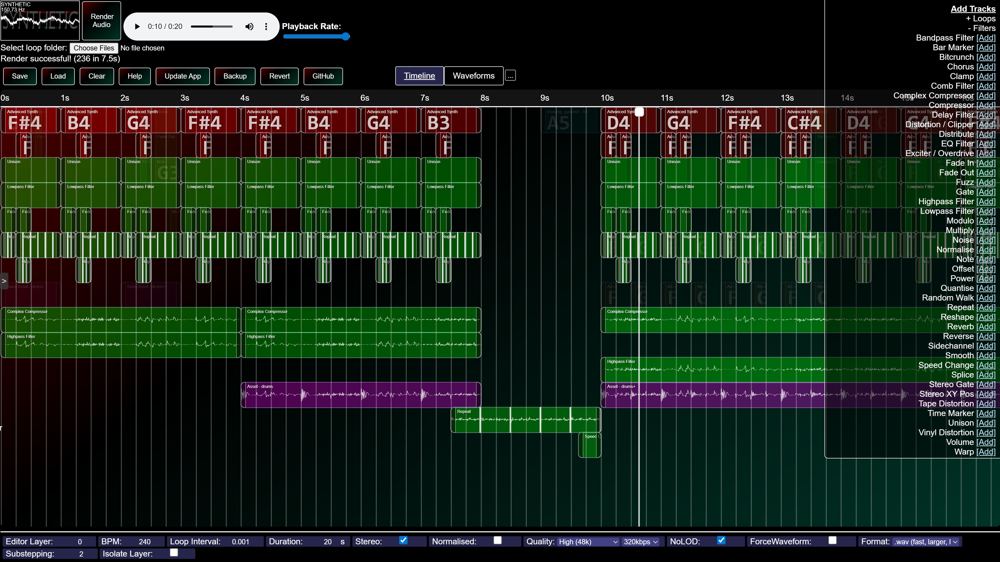
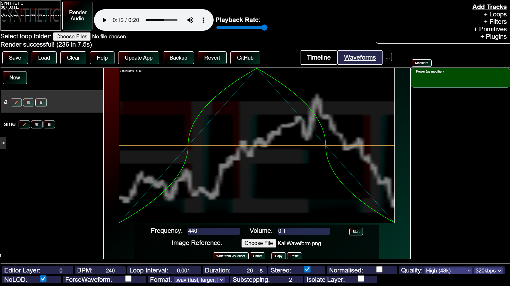

# A feature-rich web-based DAW
SYNTHETIC Audio is a DAW made from scratch, with almost no inspiration from other softwares. Almost everything is implemented in a different and unique way.\
[Try it here](https://zxmushroom63.github.io/synthetic-audio/)\
[As multiplayer discord activity](https://discord.com/oauth2/authorize?client_id=1403677664514146325)\
[Join the discord server!](https://discord.gg/3j3DRGmANn)

## Demo project files
You can find demo files in the [demos folder](/demos/).
- synth_demo.sm - Song demonstrating how synths work in SYNTHETIC
- guitar_demo.sm - Demo file showcasing playing instruments from soundfonts. Go on the plugins tab (inside the ...) and press 'Download FluidR3-GM Soundfonts' to hear the instruments. You will need to reload for the changes to take effect.
- synth2_demo.sm - Longer song demonstrating how synths work in SYNTHETIC, along with heavy use of the filter stack.

## Feature list:
- Multiplayer support!
- Timeline
- Powerful Chord Editor
- MIDI I/Os
- The Fl Studio Arpeggiator
- Soundfonts (MIDI.js format)
- Use audio samples, with pitch-sampling support
- Synths (subtractive & wavetable)
- Editor layers
- Lots of filters
- Easily draw custom waveforms (Waveforms tab)
- Stereo audio and noise
- Waveform visualiser
- Cool logo
- More LFOs than you know what to do with
- ffmpeg transcoding - export as wav, mp3, m4a, flac, opus & ogg
- Soundfonts (plugins tab & instrument node & souindfont2 node, supports MIDI.js and .sf2) - Use up to 127 instruments, more if you find plugins
- HVCC patch support - Load puredata (.pd) patches compiled with [my fork of hvcc](https://github.com/ZXMushroom63/hvcc)
- WakaTime integration (check settings menu)

## Hosting
### Offline
You can load SYNTHETIC from a `file://` URL, and it will function. You won't be able to use ffmpeg codecs (only wav), and no multiplayer support.
### Static website
Host as a static website (eg: github pages). You can use all features, including ffmpeg codecs. Bandwidth usage is heavily optimised through service workers, so you should stay under any quotas very easily.
### Multiplayer server
Clone the repository, run `npm i` and then run `npm run host`. This will activate a server with multiplayer support. To use it, simply go to `http://localhost:80`. You should automatically connect to the server. Note that the server will not save the project between restarts, you must manually save to a file and load it.
If you know your IP and how to port-forward, or create tunnels, you can connect to a server via IP using the `Remote Multiplayer` module in the `Misc` tab.
